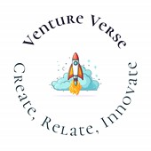

# Welcome to **VentureVerse @ ASU** 🚀

**_Create, Relate, Innovate_**

## About Us 🌟

Welcome to **VentureVerse**, where the next generation of innovators and entrepreneurs come to thrive! We are a dynamic community at Arizona State University, driven by creativity, collaboration, and the power of ideas. Our mission is to empower students with the mentorship, resources, and network they need to transform groundbreaking ideas into impactful ventures.

### Why VentureVerse? 💡

At **VentureVerse**, we believe in:
- **Innovation**: Helping you unlock and realize your potential.
- **Collaboration**: Bringing together like-minded individuals to create meaningful change.
- **Practical Skills**: Offering hands-on experience and opportunities to develop real-world skills.
- **Support**: Building a strong, inclusive environment where everyone is encouraged to dream big.

If you're ready to shape the future, innovate, and make a lasting impact, you've found your tribe!

## 🚀 **Opportunities Await!**

We've created this page to connect you with exciting professional development resources. Explore internships, new grad roles, and case competitions that can help launch your career!

### Explore 2025 Internship Opportunities 🌱
Access a curated list of Summer 2025 internships from leading tech companies and startups. Browse the latest openings, and find your perfect role to kickstart your career.

### Find New Grad Positions for 2025 🎓
Looking to take the next step after graduation? Check out the newest full-time roles designed for fresh graduates who are ready to take on the world!

### Join Case Competitions ⚖️
Test your skills and problem-solving abilities by participating in various case competitions. Compete, learn, and grow with real-world business challenges.

---

## How to Navigate 📜
- **Internship Listings**: Find a comprehensive list of Summer 2025 internships [here](./internships.json).
- **New Grad Positions**: View roles for recent graduates [here](./newgrad.json).
- **Case Competitions**: Discover active case competitions [here](./competitions.json).

---

## **Get Involved with VentureVerse!**
Want to contribute? Whether you're sharing an opportunity or collaborating on a project, we’re all about building a community where everyone can thrive. Submit an issue or pull request, and let’s create something amazing together!

Join us on this exciting journey to **Create, Relate, Innovate**! 🌍💼

## **Follow Us on Instagram using the link below: 

---

_Made with 💡 by the innovators at VentureVerse @ ASU_

---

Once you’ve uploaded the image to GitHub, just ensure that the image URL matches the path to where you upload the logo (e.g., `./assets/image.png`).
